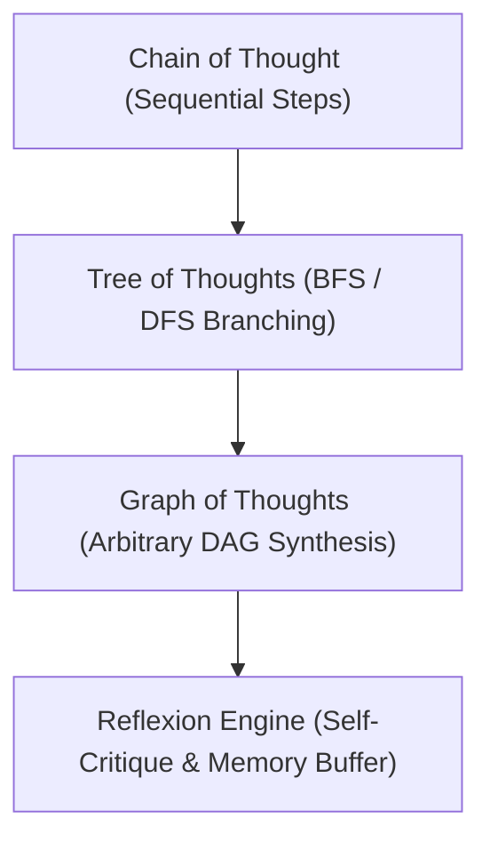

# Autonomous AI Agents & Reasoning API Reference

The `chokkhu.models.agents` package implements sovereign agentic execution engines, structured deliberation algorithms, memory systems, and multi-agent coordination frameworks.

---

## 1. ReAct Execution Engine (`ReActAgent`)

Interleaves Thought, Action, and Observation cycles with structured tool calling:

```python
from chokkhu.models.agents import ReActAgent, ToolRegistry

registry = ToolRegistry()

@registry.register(name="calculator", description="Evaluates arithmetic expressions")
def calc(expr: str) -> str:
    return str(eval(expr))

agent = ReActAgent(tools=registry, max_steps=5)
response = agent.run("What is (25 * 40) + 150?")
print(f"Agent Deliberation Result: {response.output}")
```

---

## 2. Structured Deliberation Frameworks



- **Tree of Thoughts (`TreeOfThoughts`)**: Explores multiple reasoning branches with heuristic state evaluation and backtracking.
- **Graph of Thoughts (`GraphOfThoughts`)**: Synthesizes and combines insights from multiple divergent thought trajectories into a single DAG.
- **Reflexion Engine (`ReflexionEngine`)**: Evaluates trial outcomes, generates linguistic self-reflections, and stores critiques into episodic memory to improve future attempts.
- **Multi-Agent Coordinator (`MultiAgentCoordinator`)**: Orchestrates cooperative or debate-driven agent coalitions with consensus voting.
