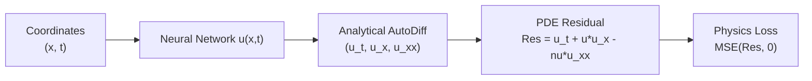

# Scientific Machine Learning & PINNs API Reference

The `chokkhu.sciml` package implements Physics-Informed Neural Networks (PINNs), Neural Ordinary Differential Equations (Neural ODE), and Symbolic Regression using Genetic Programming.

---

## 1. Physics-Informed Neural Networks (PINNs)

PINNs embed partial differential equations (PDEs) directly into neural network loss functions using automatic differentiation.

$$\mathcal{L}_{\text{total}} = \mathcal{L}_{\text{data}} + \lambda_{\text{pde}} \mathcal{L}_{\text{pde}} + \lambda_{\text{bc}} \mathcal{L}_{\text{bc}}$$



### Supported Classical Differential Equations
- `BurgersPINN`: Non-linear fluid dynamics: $u_t + u u_x - \nu u_{xx} = 0$.
- `HeatPINN`: Thermal diffusion: $u_t - \alpha u_{xx} = 0$.
- `WavePINN`: Acoustic/electromagnetic propagation: $u_{tt} - c^2 u_{xx} = 0$.

```python
import numpy as np
from chokkhu.sciml.pinns import BurgersPINN

pinn = BurgersPINN(hidden_dim=32, num_layers=3, nu=0.01 / np.pi)

# Fit on collocation points & boundary conditions
x_colloc = np.random.uniform(-1, 1, (200, 1))
t_colloc = np.random.uniform(0, 1, (200, 1))
# ... provide boundary conditions ...
pinn.fit(x_colloc, t_colloc, x_init, t_init, u_init, x_bc_left, x_bc_right, t_bc)
```

---

## 2. Neural Ordinary Differential Equations (`NeuralODE`)

Parameterizes continuous hidden state dynamics by a neural network vector field using explicit 4th-order Runge-Kutta integration:

$$\frac{d h(t)}{d t} = f_\theta(h(t), t), \quad h(t_1) = h(t_0) + \int_{t_0}^{t_1} f_\theta(h(t), t) \, dt$$

$$\text{RK4: } k_1 = f(h_n, t_n), \quad k_2 = f\left(h_n + \frac{\Delta t}{2} k_1, t_n + \frac{\Delta t}{2}\right), \quad \dots$$

```python
from chokkhu.sciml.neural_ode import NeuralODE

node = NeuralODE(state_dim=4, hidden_dim=32, num_steps=20)
h0 = np.random.randn(8, 4)
trajectory = node.forward(h0, t_span=(0.0, 1.0))
```

---

## 3. Symbolic Regression (`SymbolicRegressor`)

Discovers closed-form mathematical equations $y = f(x_1, x_2, \dots)$ from raw experimental data using Genetic Programming and evolutionary expression tree mutations.

## Example

```python
import numpy as np
from chokkhu.models.sciml.pinn import PhysicsInformedNN

# Simple PDE dataset
X = np.random.rand(100, 2)
pinn = PhysicsInformedNN(layers=[2, 32, 32, 1])
pinn.train(X, epochs=50)
print("PINN trained successfully.")
```
