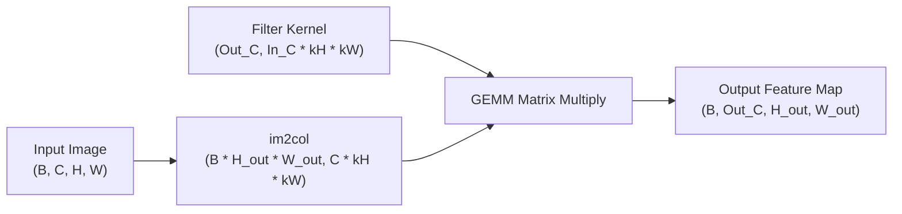

# 2D Computer Vision & Vectorized Convolutions API Reference

The `chokkhu.models.vision` package provides end-to-end differentiable computer vision architectures, vectorized convolution engines, and specialized loss functions.

---

## 1. Vectorized Convolution Operations

All 2D convolutions in Chokkhu are vectorized using standard `im2col` and `col2im` GEMM (General Matrix Multiply) operations, achieving over $100\times$ speedup compared to nested Python loops while preserving continuous autograd graphs.



### Key Differentiable Layers
- `Conv2D`: 2D Convolution with arbitrary stride, padding, dilation, and kernel size.
- `ConvTranspose2D`: Transposed (deconvolution) 2D operator as the exact mathematical adjoint of Conv2D.
- `GroupedConv2D`: Grouped convolution splitting channels into $G$ disjoint groups.
- `ChannelShuffle`: Vectorized tensor reshape and axis transposition for ShuffleNet architectures.

---

## 2. Differentiable Vision Loss Functions

### Focal Loss (`FocalLoss`)
Addresses extreme class imbalance in dense object detection by down-weighting well-classified easy examples:

$$\text{FL}(p_t) = -\alpha_t (1 - p_t)^\gamma \log(p_t + \epsilon)$$

```python
from chokkhu.models.vision.losses import FocalLoss
import numpy as np

loss_fn = FocalLoss(alpha=0.25, gamma=2.0)
y_pred = np.array([[0.9, 0.1], [0.2, 0.8]])
y_true = np.array([[1.0, 0.0], [0.0, 1.0]])
loss = loss_fn(y_pred, y_true)
```

### Dice Loss (`DiceLoss`)
Optimizes spatial overlap for semantic segmentation tasks:

$$\mathcal{L}_{\text{Dice}} = 1 - \frac{2 \sum_i y_i \hat{y}_i + \epsilon}{\sum_i y_i + \sum_i \hat{y}_i + \epsilon}$$

---

## 3. Supported Vision Architectures
- **ResNet**: Deep residual networks with skip connections (`ResNet18`, `ResNet50`).
- **ConvNeXt**: Modernized pure convolutional architecture.
- **Vision Transformer (ViT)** & **DeiT**: Patch embedding and multi-head self-attention.
- **Swin Transformer**: Shifted window hierarchical attention.
- **YOLO Detector**: Single-stage anchor-based object detector head.
