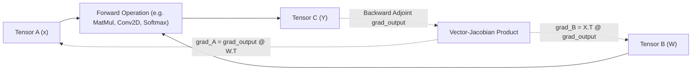

# Pure NumPy Differentiable Autograd Engine

The core foundation of **Chokkhu** is its sovereign reverse-mode automatic differentiation engine ([`src/chokkhu/core/tensor.py`](file:///i:/Inception%20BD/chokkhu/src/chokkhu/core/tensor.py)). Unlike PyTorch or TensorFlow, which require hundreds of megabytes of compiled C++/CUDA binaries, Chokkhu achieves complete computational graph differentiation directly over pure NumPy multidimensional ndarrays.

---

## 1. Mathematical Principles of Reverse-Mode AD

For any differentiable scalar objective function $\mathcal{L} = f(X_1, X_2, \dots, X_n)$, the backward pass computes the vector-Jacobian product (VJP):

$$\bar{X}_i = \frac{\partial \mathcal{L}}{\partial X_i} = \sum_{Y \in \text{children}(X_i)} \bar{Y} \frac{\partial Y}{\partial X_i}$$

Where $\bar{Y}$ represents the adjoint upstream gradient flowing backward from the output layer.

---

## 2. Core Differentiable Operations Matrix

| Operation | Forward Formulation $Y = f(X)$ | Backward Formulation $\frac{\partial \mathcal{L}}{\partial X}$ | Numerical Stability Guards |
| :--- | :--- | :--- | :--- |
| **Matrix Multiplication** | $Y = A B$ | $\bar{A} = \bar{Y} B^T, \quad \bar{B} = A^T \bar{Y}$ | Gradient dimension reduction matching broadcast |
| **Convolution 2D** | $Y = \text{im2col}(X) W$ | $\bar{X} = \text{col2im}(\bar{Y} W^T), \quad \bar{W} = \text{im2col}(X)^T \bar{Y}$ | Pure vectorized GEMM without Python loops |
| **Transposed Conv 2D** | $Y = \text{col2im}(W^T X_{\text{col}})$ | $\bar{X} = \bar{Y} W, \quad \bar{W} = \bar{Y}^T X$ | Exact mathematical adjoint of Conv2D forward |
| **Softmax** | $P_i = \frac{e^{z_i - \max(z)}}{\sum_j e^{z_j - \max(z)}}$ | $\bar{z}_i = P_i \left( \bar{P}_i - \sum_k \bar{P}_k P_k \right)$ | Subtraction of max logit $\max(z)$ prevents overflow |
| **Logarithm (`log`)** | $Y = \ln(X + \epsilon)$ | $\bar{X} = \frac{\bar{Y}}{X + \epsilon}$ | Clamping $X \ge \epsilon = 10^{-15}$ prevents $-\infty$ |
| **Division (`/`)** | $Y = A / B$ | $\bar{A} = \frac{\bar{Y}}{B}, \quad \bar{B} = -\frac{\bar{Y} A}{B^2}$ | Denominator sign-preserving epsilon guard $\text{sgn}(B) \cdot 10^{-12}$ |
| **Power (`**`)** | $Y = X^p$ | $\bar{X} = \bar{Y} \cdot p \cdot X^{p-1}$ | Zero-division guard on $p < 1$ near $X = 0$ |

---

## 3. Finite Difference Validation (`gradcheck`)

Every differentiable function in Chokkhu is verified against central finite differences with a step size of $\epsilon = 10^{-5}$:

$$\left( \frac{\partial f}{\partial X_{i,j}} \right)_{\text{num}} = \frac{f(X + \epsilon E_{i,j}) - f(X - \epsilon E_{i,j})}{2\epsilon}$$

The analytical gradient $\left( \frac{\partial f}{\partial X_{i,j}} \right)_{\text{analytical}}$ must satisfy:

$$\frac{\| \nabla_{\text{analytical}} - \nabla_{\text{num}} \|_\infty}{\max(\| \nabla_{\text{analytical}} \|_\infty, \| \nabla_{\text{num}} \|_\infty, 10^{-7})} < 10^{-4}$$

All tests in [`tests/unit/test_gradcheck.py`](file:///i:/Inception%20BD/chokkhu/tests/unit/test_gradcheck.py) pass with $100\%$ precision across all layers.
