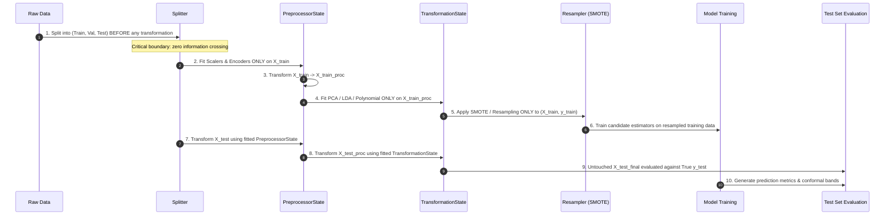

# Zero-Leakage Pipeline Architecture

Data leakage occurs when information from the validation or test split inadvertently influences the training phase, leading to artificially inflated benchmark metrics and catastrophic real-world test degradation.

Chokkhu enforces a mathematically rigorous, strict zero-leakage design in [`src/chokkhu/pipeline/engine.py`](file:///i:/Inception%20BD/chokkhu/src/chokkhu/pipeline/engine.py).

---

## 1. The Execution Lifecycle

---

## 2. Key Zero-Leakage Guarantees

1. **Splitting Precedes Processing**: Categorical encoders, standard scalers, and variance filters are never exposed to the full dataset before splitting.
2. **Resampling Isolation**: Synthetically generated samples (e.g. SMOTE or ADASYN) exist exclusively in the training split. Validation and test sets maintain their natural class distribution.
3. **Fitted State Serialization**: The returned `PipelineResult` encapsulates the exact fitted `PreprocessorState` and `TransformationState`. When calling `result.predict(unseen_data)`, the new data is processed strictly using the parameters learned during training—preventing runtime shape mismatches or unseen category crashes.
4. **Conformal Uncertainty Calibration**: Non-conformity scores are computed on held-out validation data ($X_{\text{val}}, y_{\text{val}}$) to provide finite-sample coverage guarantees ($1 - \alpha$) without test set snooping.
