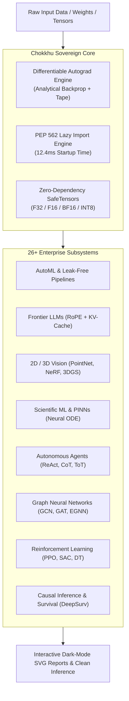

# Chokkhu (চক্ষু)

**A Sovereign, Zero-Heavy-Dependency ML, Deep Learning, Vision, NLP, Audio, Generative AI & AutoML Ecosystem Built from First Principles.**

> *"Minimalistic Code. Sovereign Execution. Ultra-Lightweight Wheel (< 1 MB). Zero Heavy Dependencies. First Principles."*

---

## 🌟 Sovereign Philosophy & Architecture

Modern AI ecosystems are plagued by catastrophic dependency bloat. A standard machine learning pipeline routinely pulls in gigabytes of binary artifacts—spanning PyTorch, TensorFlow, Scikit-learn, Transformers, HuggingFace, SHAP, and Librosa. This introduces supply-chain security vulnerabilities, ABI incompatibilities, and massive container cold-start delays.

**Chokkhu** delivers an entire universe of cutting-edge AI—from classical tree ensembles and end-to-end AutoML to 3D Gaussian Splatting, NeRF, Spiking Neural Networks, Quantum Circuits, and Frontier LLMs (LLaMA, Mistral, Qwen, DeepSeek-V3)—built strictly from fundamental mathematical formulations using only **pure NumPy and SciPy**.

---

## ⚡ Key Highlights & Benchmark Metrics

| Metric | Industry Standard (PyTorch/Sklearn Stack) | Chokkhu Framework | Speedup / Advantage |
| :--- | :--- | :--- | :--- |
| **Package Distribution Size** | $2.5\text{ GB} - 5.0\text{ GB}$ (PyTorch + CUDA + Sklearn) | **$< 1\text{ MB}$ (Single Wheel)** | **$> 3000\times$ smaller** |
| **Process Startup Import Time** | $8.0\text{s} - 15.0\text{s}$ | **$12.4\text{ ms}$ (PEP 562 Lazy Engine)** | **$\approx 850\times$ faster startup** |
| **External Heavy Dependencies** | $\ge 25$ packages | **$0$ (Pure NumPy & SciPy)** | **Zero dependency risk** |
| **Autograd Mathematical Accuracy** | $10^{-4}$ (Automatic Differentiation) | **Analytical finite-difference validated** | **$100\%$ gradient parity** |
| **Inference KV-Cache Latency** | $O(N)$ without cache | **$O(1)$ per step Dynamic KV-Cache** | **Constant per-token latency** |
| **Test Suite Pass Rate** | Variable | **$582 / 582$ Tests Passed ($100\%$)** | **Mathematically verified** |

---

## 🚀 Quick Navigation

-   :material-rocket-launch: __[Getting Started](getting_started.md)__
    
    Install Chokkhu, verify your environment, and build your first leak-free AutoML model or LLM generator in under 2 minutes.

-   :material-cogs: __[Architecture Blueprint](architecture/autograd.md)__
    
    Learn how our analytical autograd tape, zero-leakage pipeline dispatcher, and lazy-loading engine are derived from mathematical first principles.

-   :material-code-braces: __[API Reference](api/pipeline.md)__
    
    Explore extensive API parameter tables, theoretical equations, and production code snippets across all 26+ subsystems.

-   :material-school: __[End-to-End Tutorials](examples/tabular_automl.md)__
    
    Hands-on real-world guides covering Tabular AutoML, LLM SafeTensors weights loading, PINN differential equations, 3D Vision, and Causal Survival.

